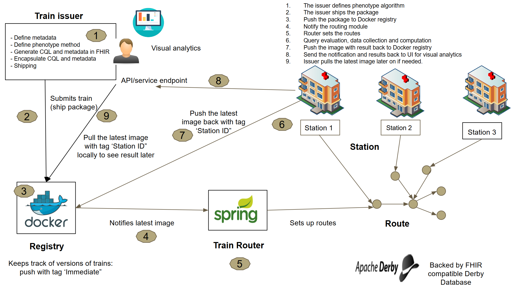

# Body Mass Index (BMI) calculation on FHIR 

## Repository
This repository is structured into two different folders:
- Client (web-app): Can be used for composing the pnenotype algorithm, packaging, shipping, train monitoring, result receive and visualization. The web-app can be accessed at http://menzel.informatik.rwth-aachen.de:3000/login. You need to register first. Then you'll be able to enjoy the features.  
- Docker registry: for hosting the train and updaing their status, which can be accessed at http://menzel.informatik.rwth-aachen.de:3005
- Routing module: make sure each trains dispatches to the handling station smoothly
- Handling station: PHT station runtime, where all the data retreival and computations happen. 
- CQL evaluation engine: used to evaluate and validate CQL query expression on the client-side (web app) before shippin. This service is hosted at http://menzel.informatik.rwth-aachen.de:8082/ but available only for GET method. 
- Sample CQL input: see Input.cql file shows a CQL expression, which will filter all the patient whose are over 50 kg and height is 45 inch. 

Take a look at the below workflow to get an overall idea: 

   
## Video demo
A video demo showing all the steps can be found at this link: https://drive.google.com/file/d/1lMn5kj8fmdkLy9iZ653mle3MuunDLVVf/view

## Interactive notebook
Querying_FHIR_server_with_CQL_expression_and_compute_BMI.ipynb can be executed to run the PHT BMI counter. This will:
- Queries a FHIR server (containing 65 patients records in FHIR standard). For this, we use our own FHIR server hosted at http://menzel.informatik.rwth-aachen.de:8080/baseDstu3/. This works both as a FHIR server as well as terminology server.  
- Pulls the FHIR resource bundle, 
- Performs some minor preprocessing and 
- Finally compute the BMI of each patient that satisfy filtering criteria in the CQL query file (see Input.cql file). 

## Up next
We plan to provide more details and full automated way to run this demo so that:
- The client can define the phenotype algorithm from a web-app, 
- Ships the package to be pushed to the Docker registry. 
- Then the handler (station) gets notified automatically (well, the routing module schedules it, though). 
- The train gets executed at the startion, send the result back to the client on the web-app result service endpoint. 
- Additionally, the handling station pushes the updated image to the Docker registry. 

## Developing a FHIR client
We plan to develop a web application for easy query FHIR server instead of a manual one shown in the notebook. We plan to extend the "SMART on FHIR client" (https://github.com/smart-on-fhir/client-py) for that.

